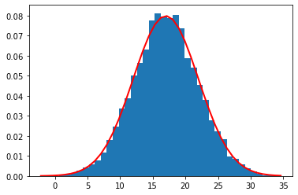
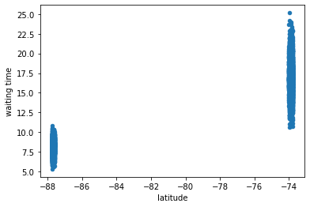
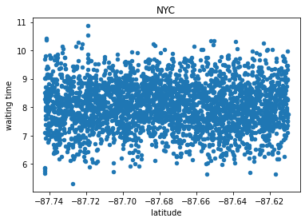
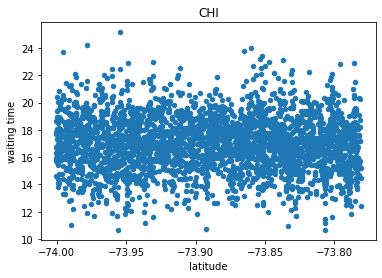

We will sample two seperate locations with random data in effort to simulate a predictive algorithm on parking wait times for the future when the data becomes available.

NYC has mean 15-20 minutes, low 5 min and high as 60 min.
We know that New York City has an average wait time of approximately 17 minutes, with a bit of standard deviation. We'll simplify to $\mu_{NYC} = 17$ and $\sigma_{NYC} = 5$

Let's generate some random data points with this in mind.


```python
import numpy as np
import pandas as pd
import matplotlib.pyplot as plt
from sklearn.ensemble import RandomForestRegressor
```


```python
NYC_mu = 17
NYC_sigma = 5
N = 10000
NYC_times = np.random.normal(NYC_mu, NYC_sigma,N)
```

We create a normal distribution with 10,000 sample points of parking search time in NYC. Each will associate with a coordinate set. We graph below with 40 bins, approximately 1 per minute.


```python
count, bins, ignored = plt.hist(NYC_times, 40, density=True)
plt.plot(bins, 1/(NYC_sigma * np.sqrt(2 * np.pi)) *
        np.exp( - (bins - NYC_mu)**2 / (2 * NYC_sigma**2) ),
        linewidth=2, color='r')
plt.show()
```


    

    


```python
NYC_time_df = pd.DataFrame(NYC_times, columns = ['waiting time'])
```


```python
NYC_time_df.head()
```


<div>
<style scoped>
    .dataframe tbody tr th:only-of-type {
        vertical-align: middle;
    }

    .dataframe tbody tr th {
        vertical-align: top;
    }

    .dataframe thead th {
        text-align: right;
    }
</style>
<table border="1" class="dataframe">
  <thead>
    <tr style="text-align: right;">
      <th></th>
      <th>waiting time</th>
    </tr>
  </thead>
  <tbody>
    <tr>
      <th>0</th>
      <td>14.846623</td>
    </tr>
    <tr>
      <th>1</th>
      <td>17.230997</td>
    </tr>
    <tr>
      <th>2</th>
      <td>20.792432</td>
    </tr>
    <tr>
      <th>3</th>
      <td>9.591650</td>
    </tr>
    <tr>
      <th>4</th>
      <td>15.292918</td>
    </tr>
  </tbody>
</table>
</div>


Now let's generate the coordinates from lat: [-74.000702, -73.781132] and lng: [40.583828, 40.867068]. These are approximate coordinates of what NYC is constrained in.


```python
NYC_lat_min = -74.000702
NYC_lat_max = -73.781132
NYC_lng_min = 40.583828
NYC_lng_max = 40.867068
```


```python
NYC_lat_data = np.random.uniform(low=NYC_lat_min, high=NYC_lat_max, size=(N,))
NYC_lng_data = np.random.uniform(low=NYC_lng_min, high=NYC_lng_max, size=(N,))
```


```python
NYC_lat_df = pd.DataFrame(NYC_lat_data, columns = ['latitude'])
NYC_lng_df = pd.DataFrame(NYC_lng_data, columns = ['longitude'])
```


```python
NYC_lat_df.head()
```


<div>
<style scoped>
    .dataframe tbody tr th:only-of-type {
        vertical-align: middle;
    }

    .dataframe tbody tr th {
        vertical-align: top;
    }

    .dataframe thead th {
        text-align: right;
    }
</style>
<table border="1" class="dataframe">
  <thead>
    <tr style="text-align: right;">
      <th></th>
      <th>latitude</th>
    </tr>
  </thead>
  <tbody>
    <tr>
      <th>0</th>
      <td>-73.870010</td>
    </tr>
    <tr>
      <th>1</th>
      <td>-73.892297</td>
    </tr>
    <tr>
      <th>2</th>
      <td>-73.866596</td>
    </tr>
    <tr>
      <th>3</th>
      <td>-73.874017</td>
    </tr>
    <tr>
      <th>4</th>
      <td>-73.785502</td>
    </tr>
  </tbody>
</table>
</div>


```python
NYC_lng_df.head()
```


<div>
<style scoped>
    .dataframe tbody tr th:only-of-type {
        vertical-align: middle;
    }

    .dataframe tbody tr th {
        vertical-align: top;
    }

    .dataframe thead th {
        text-align: right;
    }
</style>
<table border="1" class="dataframe">
  <thead>
    <tr style="text-align: right;">
      <th></th>
      <th>longitude</th>
    </tr>
  </thead>
  <tbody>
    <tr>
      <th>0</th>
      <td>40.865672</td>
    </tr>
    <tr>
      <th>1</th>
      <td>40.690721</td>
    </tr>
    <tr>
      <th>2</th>
      <td>40.807726</td>
    </tr>
    <tr>
      <th>3</th>
      <td>40.779291</td>
    </tr>
    <tr>
      <th>4</th>
      <td>40.667577</td>
    </tr>
  </tbody>
</table>
</div>


```python
NYC_pd = pd.concat([NYC_time_df, NYC_lat_df, NYC_lng_df], axis=1)
```

We combine it all into one dataframe of 10,000 random samples to play with.


```python
NYC_pd.describe()
```


<div>
<style scoped>
    .dataframe tbody tr th:only-of-type {
        vertical-align: middle;
    }

    .dataframe tbody tr th {
        vertical-align: top;
    }

    .dataframe thead th {
        text-align: right;
    }
</style>
<table border="1" class="dataframe">
  <thead>
    <tr style="text-align: right;">
      <th></th>
      <th>waiting time</th>
      <th>latitude</th>
      <th>longitude</th>
    </tr>
  </thead>
  <tbody>
    <tr>
      <th>count</th>
      <td>10000.000000</td>
      <td>10000.000000</td>
      <td>10000.000000</td>
    </tr>
    <tr>
      <th>mean</th>
      <td>17.010551</td>
      <td>-73.890369</td>
      <td>40.726163</td>
    </tr>
    <tr>
      <th>std</th>
      <td>4.957935</td>
      <td>0.063868</td>
      <td>0.082012</td>
    </tr>
    <tr>
      <th>min</th>
      <td>-2.146972</td>
      <td>-74.000702</td>
      <td>40.583866</td>
    </tr>
    <tr>
      <th>25%</th>
      <td>13.709601</td>
      <td>-73.945969</td>
      <td>40.654259</td>
    </tr>
    <tr>
      <th>50%</th>
      <td>16.976025</td>
      <td>-73.890077</td>
      <td>40.727251</td>
    </tr>
    <tr>
      <th>75%</th>
      <td>20.315842</td>
      <td>-73.834607</td>
      <td>40.797531</td>
    </tr>
    <tr>
      <th>max</th>
      <td>34.622431</td>
      <td>-73.781132</td>
      <td>40.867048</td>
    </tr>
  </tbody>
</table>
</div>


Let's quickly repeat this process with Chicago with a mean of $\mu_{CHI} = 8$ minutes and $\sigma_{CHI} = 2$. As well as the following constraints:


```python
CHI_lat_min = -87.742439
CHI_lat_max = -87.610119
CHI_lng_min = 41.652487
CHI_lng_max = 41.996954
```


```python
CHI_mu = 8
CHI_sigma = 2
CHI_times = np.random.normal(CHI_mu,CHI_sigma,N)
CHI_time_df = pd.DataFrame(CHI_times, columns = ['waiting time'])
CHI_lat_data = np.random.uniform(low=CHI_lat_min, high=CHI_lat_max, size=(N,))
CHI_lng_data = np.random.uniform(low=CHI_lng_min, high=CHI_lng_max, size=(N,))
CHI_lat_df = pd.DataFrame(CHI_lat_data, columns = ['latitude'])
CHI_lng_df = pd.DataFrame(CHI_lng_data, columns = ['longitude'])
CHI_pd = pd.concat([CHI_time_df, CHI_lat_df, CHI_lng_df], axis=1)
CHI_pd.describe()
```


<div>
<style scoped>
    .dataframe tbody tr th:only-of-type {
        vertical-align: middle;
    }

    .dataframe tbody tr th {
        vertical-align: top;
    }

    .dataframe thead th {
        text-align: right;
    }
</style>
<table border="1" class="dataframe">
  <thead>
    <tr style="text-align: right;">
      <th></th>
      <th>waiting time</th>
      <th>latitude</th>
      <th>longitude</th>
    </tr>
  </thead>
  <tbody>
    <tr>
      <th>count</th>
      <td>10000.000000</td>
      <td>10000.000000</td>
      <td>10000.000000</td>
    </tr>
    <tr>
      <th>mean</th>
      <td>8.029514</td>
      <td>-87.675508</td>
      <td>41.824295</td>
    </tr>
    <tr>
      <th>std</th>
      <td>2.028416</td>
      <td>0.037962</td>
      <td>0.099210</td>
    </tr>
    <tr>
      <th>min</th>
      <td>1.140385</td>
      <td>-87.742420</td>
      <td>41.652544</td>
    </tr>
    <tr>
      <th>25%</th>
      <td>6.674305</td>
      <td>-87.707906</td>
      <td>41.739865</td>
    </tr>
    <tr>
      <th>50%</th>
      <td>8.003397</td>
      <td>-87.674959</td>
      <td>41.823477</td>
    </tr>
    <tr>
      <th>75%</th>
      <td>9.405170</td>
      <td>-87.642864</td>
      <td>41.909296</td>
    </tr>
    <tr>
      <th>max</th>
      <td>15.798255</td>
      <td>-87.610120</td>
      <td>41.996938</td>
    </tr>
  </tbody>
</table>
</div>


Now we will apply a Random Forest Regression classifier on our datasets. We will split our data randomly reserving 30% for testing and the rest for training.


```python
predictions.plot(
    kind='scatter',
    x='latitude', 
    y='waiting time'
    label='test'
)train_NYC, test_NYC = train_test_split(NYC_pd, test_size=0.3, shuffle=True)
train_CHI, test_CHI = train_test_split(CHI_pd, test_size=0.3, shuffle=True)
```


```python
train = pd.concat([train_NYC, train_CHI], axis=0)
```


```python
test = pd.concat([test_NYC, test_CHI], axis=0)
```


```python
FEAT_SET = ['latitude', 'longitude']
TARGET = 'waiting time'
```


```python
X_test = test[FEAT_SET]
y_test = test[TARGET]

X_train = train[FEAT_SET]
y_train = train[TARGET]
```

Note that there are various ways to optimize with hyperparameters but we are sticking to the simplest model for now. As the data is random we don't expect high results.


```python
rf = RandomForestRegressor(
    n_estimators=100, random_state=42
    )
rf.fit(X_train, y_train)
```


    RandomForestRegressor(random_state=42)


```python
rf.score(X_test, y_test)
```


    0.5108463255953659


```python
y_pred = rf.predict(X_test)
y_pred_df = pd.DataFrame(y_pred, columns = ['waiting time'])
X_test_df = X_test.reset_index(drop=True)
predictions = pd.concat([y_pred_df, X_test_df], axis=1)
predictions
```


<div>
<style scoped>
    .dataframe tbody tr th:only-of-type {
        vertical-align: middle;
    }

    .dataframe tbody tr th {
        vertical-align: top;
    }

    .dataframe thead th {
        text-align: right;
    }
</style>
<table border="1" class="dataframe">
  <thead>
    <tr style="text-align: right;">
      <th></th>
      <th>waiting time</th>
      <th>latitude</th>
      <th>longitude</th>
    </tr>
  </thead>
  <tbody>
    <tr>
      <th>0</th>
      <td>18.314313</td>
      <td>-73.791856</td>
      <td>40.828871</td>
    </tr>
    <tr>
      <th>1</th>
      <td>17.929462</td>
      <td>-73.902397</td>
      <td>40.797647</td>
    </tr>
    <tr>
      <th>2</th>
      <td>15.789964</td>
      <td>-73.979333</td>
      <td>40.796987</td>
    </tr>
    <tr>
      <th>3</th>
      <td>19.817220</td>
      <td>-73.809508</td>
      <td>40.586111</td>
    </tr>
    <tr>
      <th>4</th>
      <td>16.930776</td>
      <td>-73.923193</td>
      <td>40.607448</td>
    </tr>
    <tr>
      <th>...</th>
      <td>...</td>
      <td>...</td>
      <td>...</td>
    </tr>
    <tr>
      <th>5995</th>
      <td>7.474640</td>
      <td>-87.733134</td>
      <td>41.857308</td>
    </tr>
    <tr>
      <th>5996</th>
      <td>8.544990</td>
      <td>-87.656353</td>
      <td>41.865136</td>
    </tr>
    <tr>
      <th>5997</th>
      <td>6.663711</td>
      <td>-87.641233</td>
      <td>41.927476</td>
    </tr>
    <tr>
      <th>5998</th>
      <td>8.646846</td>
      <td>-87.611576</td>
      <td>41.856106</td>
    </tr>
    <tr>
      <th>5999</th>
      <td>7.104689</td>
      <td>-87.695469</td>
      <td>41.962718</td>
    </tr>
  </tbody>
</table>
<p>6000 rows × 3 columns</p>
</div>


We see a score of 51.56%, slightly above average for our randomly generated data, and predictions matching the range of the coordinate constraints per city. We can visually plot this as so:


```python
predictions.plot(
    kind='scatter',
    x='latitude', 
    y='waiting time',
);
```


    

    


We can see close up these are two clusters matching the original ranges and coordinates. Left one hovering over -88 degrees of latitude there is Chicago's cluster of waiting times and on the right there is NYC's at -74 degrees.


```python
predictions[predictions.latitude < -80].plot(
    kind='scatter',
    x='latitude', 
    y='waiting time',
    title="NYC"
);
```


    

    


```python
predictions[predictions.latitude > -80].plot(
    kind='scatter',
    x='latitude', 
    y='waiting time',
    title='CHI'
);
```


    

    


We hope to use substantial data and expand on the prediction with a more accurate model to further benefit the Parking Pal app users.
