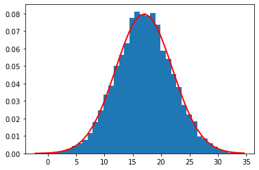
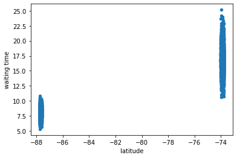
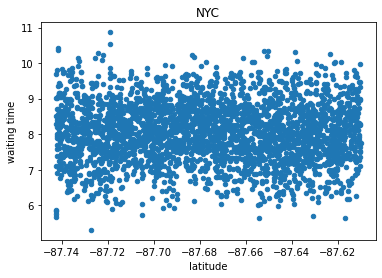
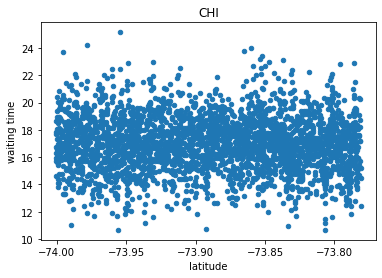

<<<<<<< HEAD
# Getting Started with Create React App

This project was bootstrapped with [Create React App](https://github.com/facebook/create-react-app).

## Available Scripts

In the project directory, you can run:

### `npm start`

Runs the app in the development mode.\
Open [http://localhost:3000](http://localhost:3000) to view it in your browser.

The page will reload when you make changes.\
You may also see any lint errors in the console.

### `npm test`

Launches the test runner in the interactive watch mode.\
See the section about [running tests](https://facebook.github.io/create-react-app/docs/running-tests) for more information.

### `npm run build`

Builds the app for production to the `build` folder.\
It correctly bundles React in production mode and optimizes the build for the best performance.

The build is minified and the filenames include the hashes.\
Your app is ready to be deployed!

See the section about [deployment](https://facebook.github.io/create-react-app/docs/deployment) for more information.

### `npm run eject`

**Note: this is a one-way operation. Once you `eject`, you can't go back!**

If you aren't satisfied with the build tool and configuration choices, you can `eject` at any time. This command will remove the single build dependency from your project.

Instead, it will copy all the configuration files and the transitive dependencies (webpack, Babel, ESLint, etc) right into your project so you have full control over them. All of the commands except `eject` will still work, but they will point to the copied scripts so you can tweak them. At this point you're on your own.

You don't have to ever use `eject`. The curated feature set is suitable for small and middle deployments, and you shouldn't feel obligated to use this feature. However we understand that this tool wouldn't be useful if you couldn't customize it when you are ready for it.

## Learn More

You can learn more in the [Create React App documentation](https://facebook.github.io/create-react-app/docs/getting-started).

To learn React, check out the [React documentation](https://reactjs.org/).

### Code Splitting

This section has moved here: [https://facebook.github.io/create-react-app/docs/code-splitting](https://facebook.github.io/create-react-app/docs/code-splitting)

### Analyzing the Bundle Size

This section has moved here: [https://facebook.github.io/create-react-app/docs/analyzing-the-bundle-size](https://facebook.github.io/create-react-app/docs/analyzing-the-bundle-size)

### Making a Progressive Web App

This section has moved here: [https://facebook.github.io/create-react-app/docs/making-a-progressive-web-app](https://facebook.github.io/create-react-app/docs/making-a-progressive-web-app)

### Advanced Configuration

This section has moved here: [https://facebook.github.io/create-react-app/docs/advanced-configuration](https://facebook.github.io/create-react-app/docs/advanced-configuration)

### Deployment

This section has moved here: [https://facebook.github.io/create-react-app/docs/deployment](https://facebook.github.io/create-react-app/docs/deployment)

### `npm run build` fails to minify

This section has moved here: [https://facebook.github.io/create-react-app/docs/troubleshooting#npm-run-build-fails-to-minify](https://facebook.github.io/create-react-app/docs/troubleshooting#npm-run-build-fails-to-minify)
=======
We will sample two seperate locations with random data in effort to simulate a predictive algorithm on parking wait times for the future when the data becomes available.

NYC has mean 15-20, low 5 high as 60
We know that New York City has an average wait time of approximately 17 minutes, with a bit of standard deviation. We'll simplify to $\mu_{NYC} = 17$ and $\sigma_{NYC} = 5$

Let's generate some random data points with this in mind.


```python
import numpy as np
import pandas as pd
import matplotlib.pyplot as plt
from sklearn.ensemble import RandomForestRegressor
```


```python
NYC_mu = 17
NYC_sigma = 5
N = 10000
NYC_times = np.random.normal(NYC_mu, NYC_sigma,N)
```

We create a normal distribution with 10,000 sample points of parking search time in NYC. Each will associate with a coordinate set. We graph below with 40 bins, approximately 1 per minute.


```python
count, bins, ignored = plt.hist(NYC_times, 40, density=True)
plt.plot(bins, 1/(NYC_sigma * np.sqrt(2 * np.pi)) *
        np.exp( - (bins - NYC_mu)**2 / (2 * NYC_sigma**2) ),
        linewidth=2, color='r')
plt.show()
```


    

    


```python
NYC_time_df = pd.DataFrame(NYC_times, columns = ['waiting time'])
```


```python
NYC_time_df.head()
```


<div>
<style scoped>
    .dataframe tbody tr th:only-of-type {
        vertical-align: middle;
    }

    .dataframe tbody tr th {
        vertical-align: top;
    }

    .dataframe thead th {
        text-align: right;
    }
</style>
<table border="1" class="dataframe">
  <thead>
    <tr style="text-align: right;">
      <th></th>
      <th>waiting time</th>
    </tr>
  </thead>
  <tbody>
    <tr>
      <th>0</th>
      <td>14.846623</td>
    </tr>
    <tr>
      <th>1</th>
      <td>17.230997</td>
    </tr>
    <tr>
      <th>2</th>
      <td>20.792432</td>
    </tr>
    <tr>
      <th>3</th>
      <td>9.591650</td>
    </tr>
    <tr>
      <th>4</th>
      <td>15.292918</td>
    </tr>
  </tbody>
</table>
</div>


Now let's generate the coordinates from lat: [-74.000702, -73.781132] and lng: [40.583828, 40.867068]. These are approximate coordinates of what NYC is constrained in.


```python
NYC_lat_min = -74.000702
NYC_lat_max = -73.781132
NYC_lng_min = 40.583828
NYC_lng_max = 40.867068
```


```python
NYC_lat_data = np.random.uniform(low=NYC_lat_min, high=NYC_lat_max, size=(N,))
NYC_lng_data = np.random.uniform(low=NYC_lng_min, high=NYC_lng_max, size=(N,))
```


```python
NYC_lat_df = pd.DataFrame(NYC_lat_data, columns = ['latitude'])
NYC_lng_df = pd.DataFrame(NYC_lng_data, columns = ['longitude'])
```


```python
NYC_lat_df.head()
```


<div>
<style scoped>
    .dataframe tbody tr th:only-of-type {
        vertical-align: middle;
    }

    .dataframe tbody tr th {
        vertical-align: top;
    }

    .dataframe thead th {
        text-align: right;
    }
</style>
<table border="1" class="dataframe">
  <thead>
    <tr style="text-align: right;">
      <th></th>
      <th>latitude</th>
    </tr>
  </thead>
  <tbody>
    <tr>
      <th>0</th>
      <td>-73.870010</td>
    </tr>
    <tr>
      <th>1</th>
      <td>-73.892297</td>
    </tr>
    <tr>
      <th>2</th>
      <td>-73.866596</td>
    </tr>
    <tr>
      <th>3</th>
      <td>-73.874017</td>
    </tr>
    <tr>
      <th>4</th>
      <td>-73.785502</td>
    </tr>
  </tbody>
</table>
</div>


```python
NYC_lng_df.head()
```


<div>
<style scoped>
    .dataframe tbody tr th:only-of-type {
        vertical-align: middle;
    }

    .dataframe tbody tr th {
        vertical-align: top;
    }

    .dataframe thead th {
        text-align: right;
    }
</style>
<table border="1" class="dataframe">
  <thead>
    <tr style="text-align: right;">
      <th></th>
      <th>longitude</th>
    </tr>
  </thead>
  <tbody>
    <tr>
      <th>0</th>
      <td>40.865672</td>
    </tr>
    <tr>
      <th>1</th>
      <td>40.690721</td>
    </tr>
    <tr>
      <th>2</th>
      <td>40.807726</td>
    </tr>
    <tr>
      <th>3</th>
      <td>40.779291</td>
    </tr>
    <tr>
      <th>4</th>
      <td>40.667577</td>
    </tr>
  </tbody>
</table>
</div>


```python
NYC_pd = pd.concat([NYC_time_df, NYC_lat_df, NYC_lng_df], axis=1)
```

We combine it all into one dataframe of 10,000 random samples to play with.


```python
NYC_pd.describe()
```


<div>
<style scoped>
    .dataframe tbody tr th:only-of-type {
        vertical-align: middle;
    }

    .dataframe tbody tr th {
        vertical-align: top;
    }

    .dataframe thead th {
        text-align: right;
    }
</style>
<table border="1" class="dataframe">
  <thead>
    <tr style="text-align: right;">
      <th></th>
      <th>waiting time</th>
      <th>latitude</th>
      <th>longitude</th>
    </tr>
  </thead>
  <tbody>
    <tr>
      <th>count</th>
      <td>10000.000000</td>
      <td>10000.000000</td>
      <td>10000.000000</td>
    </tr>
    <tr>
      <th>mean</th>
      <td>17.010551</td>
      <td>-73.890369</td>
      <td>40.726163</td>
    </tr>
    <tr>
      <th>std</th>
      <td>4.957935</td>
      <td>0.063868</td>
      <td>0.082012</td>
    </tr>
    <tr>
      <th>min</th>
      <td>-2.146972</td>
      <td>-74.000702</td>
      <td>40.583866</td>
    </tr>
    <tr>
      <th>25%</th>
      <td>13.709601</td>
      <td>-73.945969</td>
      <td>40.654259</td>
    </tr>
    <tr>
      <th>50%</th>
      <td>16.976025</td>
      <td>-73.890077</td>
      <td>40.727251</td>
    </tr>
    <tr>
      <th>75%</th>
      <td>20.315842</td>
      <td>-73.834607</td>
      <td>40.797531</td>
    </tr>
    <tr>
      <th>max</th>
      <td>34.622431</td>
      <td>-73.781132</td>
      <td>40.867048</td>
    </tr>
  </tbody>
</table>
</div>


Let's quickly repeat this process with Chicago with a mean of $\mu_{CHI} = 8$ minutes and $\sigma_{CHI} = 2$. As well as the following constraints:


```python
CHI_lat_min = -87.742439
CHI_lat_max = -87.610119
CHI_lng_min = 41.652487
CHI_lng_max = 41.996954
```


```python
CHI_mu = 8
CHI_sigma = 2
CHI_times = np.random.normal(CHI_mu,CHI_sigma,N)
CHI_time_df = pd.DataFrame(CHI_times, columns = ['waiting time'])
CHI_lat_data = np.random.uniform(low=CHI_lat_min, high=CHI_lat_max, size=(N,))
CHI_lng_data = np.random.uniform(low=CHI_lng_min, high=CHI_lng_max, size=(N,))
CHI_lat_df = pd.DataFrame(CHI_lat_data, columns = ['latitude'])
CHI_lng_df = pd.DataFrame(CHI_lng_data, columns = ['longitude'])
CHI_pd = pd.concat([CHI_time_df, CHI_lat_df, CHI_lng_df], axis=1)
CHI_pd.describe()
```


<div>
<style scoped>
    .dataframe tbody tr th:only-of-type {
        vertical-align: middle;
    }

    .dataframe tbody tr th {
        vertical-align: top;
    }

    .dataframe thead th {
        text-align: right;
    }
</style>
<table border="1" class="dataframe">
  <thead>
    <tr style="text-align: right;">
      <th></th>
      <th>waiting time</th>
      <th>latitude</th>
      <th>longitude</th>
    </tr>
  </thead>
  <tbody>
    <tr>
      <th>count</th>
      <td>10000.000000</td>
      <td>10000.000000</td>
      <td>10000.000000</td>
    </tr>
    <tr>
      <th>mean</th>
      <td>8.029514</td>
      <td>-87.675508</td>
      <td>41.824295</td>
    </tr>
    <tr>
      <th>std</th>
      <td>2.028416</td>
      <td>0.037962</td>
      <td>0.099210</td>
    </tr>
    <tr>
      <th>min</th>
      <td>1.140385</td>
      <td>-87.742420</td>
      <td>41.652544</td>
    </tr>
    <tr>
      <th>25%</th>
      <td>6.674305</td>
      <td>-87.707906</td>
      <td>41.739865</td>
    </tr>
    <tr>
      <th>50%</th>
      <td>8.003397</td>
      <td>-87.674959</td>
      <td>41.823477</td>
    </tr>
    <tr>
      <th>75%</th>
      <td>9.405170</td>
      <td>-87.642864</td>
      <td>41.909296</td>
    </tr>
    <tr>
      <th>max</th>
      <td>15.798255</td>
      <td>-87.610120</td>
      <td>41.996938</td>
    </tr>
  </tbody>
</table>
</div>


Now we will apply a Random Forest Regression classifier on our datasets. We will split our data randomly reserving 30% for testing and the rest for training.


```python
predictions.plot(
    kind='scatter',
    x='latitude', 
    y='waiting time'
    label='test'
)train_NYC, test_NYC = train_test_split(NYC_pd, test_size=0.3, shuffle=True)
train_CHI, test_CHI = train_test_split(CHI_pd, test_size=0.3, shuffle=True)
```


```python
train = pd.concat([train_NYC, train_CHI], axis=0)
```


```python
test = pd.concat([test_NYC, test_CHI], axis=0)
```


```python
FEAT_SET = ['latitude', 'longitude']
TARGET = 'waiting time'
```


```python
X_test = test[FEAT_SET]
y_test = test[TARGET]

X_train = train[FEAT_SET]
y_train = train[TARGET]
```

Note that there are various ways to optimize with hyperparameters but we are sticking to the simplest model for now. As the data is random we don't expect high results.


```python
rf = RandomForestRegressor(
    n_estimators=100, random_state=42
    )
rf.fit(X_train, y_train)
```


    RandomForestRegressor(random_state=42)


```python
rf.score(X_test, y_test)
```


    0.5108463255953659


```python
y_pred = rf.predict(X_test)
y_pred_df = pd.DataFrame(y_pred, columns = ['waiting time'])
X_test_df = X_test.reset_index(drop=True)
predictions = pd.concat([y_pred_df, X_test_df], axis=1)
predictions
```


<div>
<style scoped>
    .dataframe tbody tr th:only-of-type {
        vertical-align: middle;
    }

    .dataframe tbody tr th {
        vertical-align: top;
    }

    .dataframe thead th {
        text-align: right;
    }
</style>
<table border="1" class="dataframe">
  <thead>
    <tr style="text-align: right;">
      <th></th>
      <th>waiting time</th>
      <th>latitude</th>
      <th>longitude</th>
    </tr>
  </thead>
  <tbody>
    <tr>
      <th>0</th>
      <td>18.314313</td>
      <td>-73.791856</td>
      <td>40.828871</td>
    </tr>
    <tr>
      <th>1</th>
      <td>17.929462</td>
      <td>-73.902397</td>
      <td>40.797647</td>
    </tr>
    <tr>
      <th>2</th>
      <td>15.789964</td>
      <td>-73.979333</td>
      <td>40.796987</td>
    </tr>
    <tr>
      <th>3</th>
      <td>19.817220</td>
      <td>-73.809508</td>
      <td>40.586111</td>
    </tr>
    <tr>
      <th>4</th>
      <td>16.930776</td>
      <td>-73.923193</td>
      <td>40.607448</td>
    </tr>
    <tr>
      <th>...</th>
      <td>...</td>
      <td>...</td>
      <td>...</td>
    </tr>
    <tr>
      <th>5995</th>
      <td>7.474640</td>
      <td>-87.733134</td>
      <td>41.857308</td>
    </tr>
    <tr>
      <th>5996</th>
      <td>8.544990</td>
      <td>-87.656353</td>
      <td>41.865136</td>
    </tr>
    <tr>
      <th>5997</th>
      <td>6.663711</td>
      <td>-87.641233</td>
      <td>41.927476</td>
    </tr>
    <tr>
      <th>5998</th>
      <td>8.646846</td>
      <td>-87.611576</td>
      <td>41.856106</td>
    </tr>
    <tr>
      <th>5999</th>
      <td>7.104689</td>
      <td>-87.695469</td>
      <td>41.962718</td>
    </tr>
  </tbody>
</table>
<p>6000 rows × 3 columns</p>
</div>


We see a score of 51.56%, slighlt above average for our randomly generated data, and predictions matching the range of the coordinate constraints per city. We can visually plot this as so:


```python
predictions.plot(
    kind='scatter',
    x='latitude', 
    y='waiting time',
);
```


    

    


We can see close up these are two clusters matching the original ranges and coordinates.


```python
predictions[predictions.latitude < -80].plot(
    kind='scatter',
    x='latitude', 
    y='waiting time',
    title="NYC"
);
```


    

    


```python
predictions[predictions.latitude > -80].plot(
    kind='scatter',
    x='latitude', 
    y='waiting time',
    title='CHI'
);
```


    

    


We hope to use substantial data and expand on the prediction with a more accurate model to further benefit the Parking Pal app users.
>>>>>>> 41896a21df54f76110af542435c388d3c8883edb
